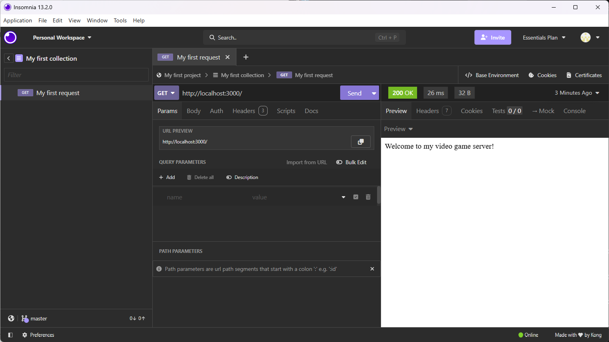
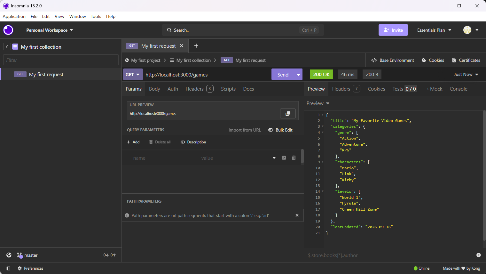
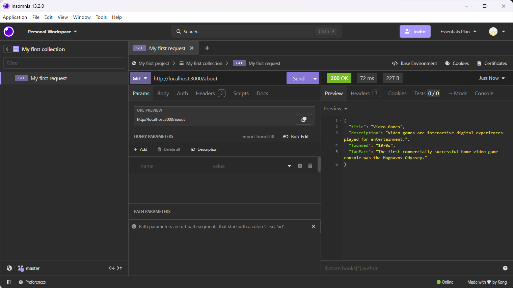
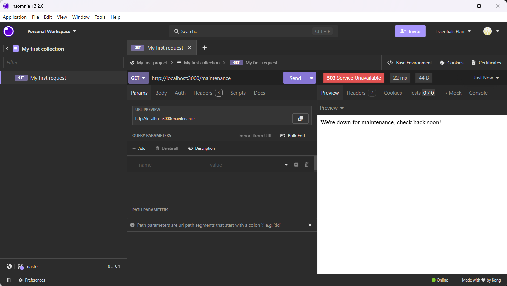
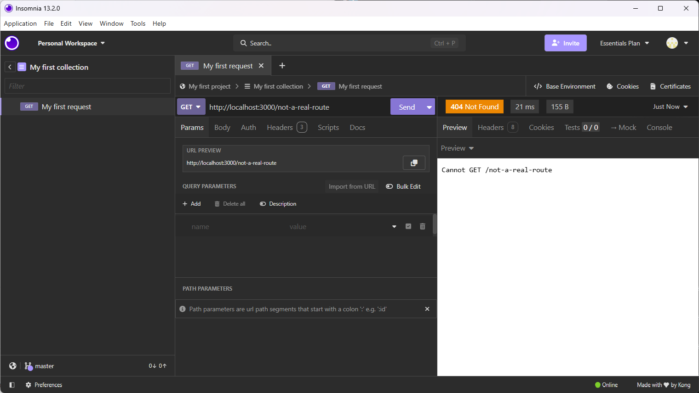

# Video Game API

A simple Express API about video games created for Week 5 HTTP/Express practice.

## Routes

| Method | Path | What it returns | Status |
|---|---|---|---|
| GET | `/` | Plain-text welcome message | 200 OK |
| GET | `/games` | Nested JSON with video game categories | 200 OK |
| GET | `/about` | JSON with information about video games | 200 OK |
| GET | `/message` | Plain-text video game message | 200 OK |
| GET | `/maintenance` | Maintenance message | 503 Service Unavailable |
| GET | `/not-a-real-route` | Route does not exist | 404 Not Found |

## Testing

All routes were tested using Insomnia.

- `/` returned 200 OK.
- `/games` returned 200 OK with the nested JSON object.
- `/about` returned 200 OK.
- `/message` returned 200 OK.
- `/maintenance` returned 503 Service Unavailable.
- `/not-a-real-route` returned 404 Not Found.

## Insomnia Screenshots

### GET /

### GET /games

### GET /about

### GET /message

[GET message route](screenshots/message.png)

### GET /maintenance

### GET /not-a-real-route

